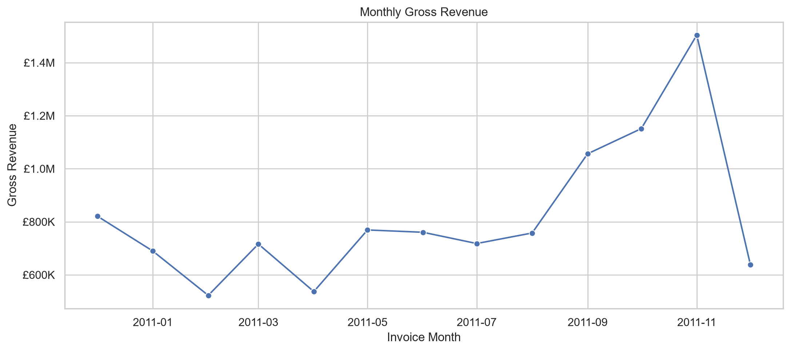
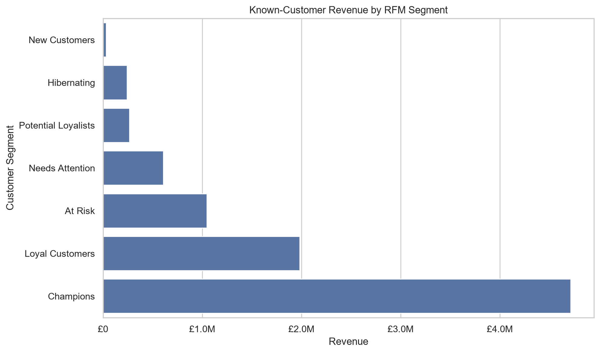

# Retail Sales Insights

## Project Overview

This project uses Python to analyze an online retail dataset and identify useful business insights.

The analysis covers data auditing, data cleaning, business KPI calculation, visualization, and RFM customer segmentation. The project also demonstrates practical use of Pandas, NumPy, Matplotlib, Seaborn, Jupyter Notebook, Git, and GitHub.

## Business Questions

This project aims to answer the following questions:

1. How does revenue change over time?
2. Which products generate the most revenue?
3. Which countries generate the most revenue?
4. Who are the highest-value customers?
5. What is the average completed order value?
6. Are there any patterns in cancellations or returns?
7. Which customer groups should the business prioritize?

## Dataset

The project uses the **Online Retail dataset** from the UCI Machine Learning Repository.

The dataset includes:

- Invoice number
- Product code
- Product description
- Quantity
- Invoice date
- Unit price
- Customer ID
- Country

The original dataset is not included in this repository. It should be downloaded separately and placed at:

```text
data/raw/Online Retail.xlsx
```

## Tools

- Python
- Pandas
- NumPy
- Matplotlib
- Seaborn
- Jupyter Notebook
- Visual Studio Code
- Git
- GitHub

## Project Workflow

1. Audited the raw transaction data.
2. Defined and applied data-cleaning rules.
3. Separated valid completed sales from cancellations and returns.
4. Created revenue and date-related features.
5. Calculated overall and category-level business KPIs.
6. Analyzed products, countries, orders, and customers.
7. Created business-focused visualizations.
8. Segmented known customers using RFM analysis.
9. Produced business findings and recommendations.

## Key Findings

- The business generated **£10.64 million** from **19,960 completed orders**.
- The average completed order value was **£533.17**.
- **November 2011** recorded the highest monthly gross revenue.
- The **United Kingdom** was the largest market and generated the majority of total revenue.
- **DOTCOM POSTAGE** was the highest-revenue recorded item, although it appears to represent a service charge rather than a physical retail product.
- **Champions** were the highest-revenue RFM customer segment.
- **At Risk customers generated 11.78% of known-customer revenue**, making them an important group for reactivation campaigns.

## Visualizations

### Monthly Revenue



### Revenue by Customer Segment



## Business Recommendations

1. Retain Champions and Loyal Customers through personalized benefits, loyalty rewards, and early-access offers.
2. Prioritize high-value At Risk customers for targeted reactivation campaigns because they still contribute **11.78% of known-customer revenue**.
3. Encourage Potential Loyalists and New Customers to place another order through product recommendations and second-purchase incentives.
4. Monitor dependence on the United Kingdom and investigate growth opportunities in other international markets.
5. Review product rankings after separating physical products from postage and service-related items.
6. Investigate cancellation and return patterns by product, country, and customer group.

## Limitations

- The dataset represents one historical online retailer.
- Product cost and profit-margin information is unavailable, so the project analyzes revenue rather than profit.
- Customers without customer IDs could not be included in customer segmentation.
- Some recorded items, such as postage charges, may not represent physical products.
- The first and final months may contain partial data.
- RFM segmentation describes historical behavior and does not predict future purchases.

## Project Structure

```text
retail-sales-insights/
├── data/
│   ├── raw/
│   └── processed/
├── notebooks/
│   ├── 01_data_audit.ipynb
│   ├── 02_data_cleaning.ipynb
│   ├── 03_business_analysis.ipynb
│   ├── 04_visualization.ipynb
│   └── 05_customer_segmentation.ipynb
├── reports/
│   ├── figures/
│   ├── tables/
│   └── executive_summary.md
├── src/
│   ├── clean_data.py
│   ├── analysis.py
│   ├── visualize.py
│   └── segmentation.py
├── .gitignore
├── README.md
└── requirements.txt
```

## How to Run

### 1. Clone the repository

```bash
git clone https://github.com/YOUR_USERNAME/retail-sales-insights.git
cd retail-sales-insights
```

Replace `YOUR_USERNAME` with your actual GitHub username.

### 2. Create a virtual environment

```bash
python -m venv .venv
```

### 3. Activate the virtual environment

On Windows PowerShell:

```powershell
.\.venv\Scripts\Activate.ps1
```

On Windows Command Prompt:

```cmd
.venv\Scripts\activate
```

### 4. Install the required packages

```bash
python -m pip install -r requirements.txt
```

### 5. Add the dataset

Place the downloaded Excel dataset at:

```text
data/raw/Online Retail.xlsx
```

### 6. Run the project pipeline

Run the scripts in order:

```bash
python src/clean_data.py
python src/analysis.py
python src/visualize.py
python src/segmentation.py
```

The notebooks can also be opened and run in numerical order.

## Project Status

The project is complete.
